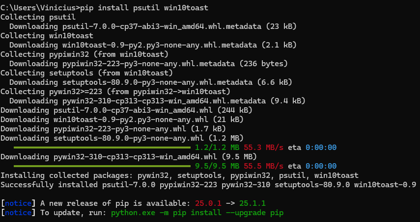

# ⚙️ Passo a passo para rodar no Windows 11
1. Instale o Python (se ainda não tiver)
Acesse python.org/downloads e baixe a versão mais recente (recomendada: 3.10+).

Durante a instalação, marque a opção ✅ Add Python to PATH.

2. Instale as bibliotecas necessárias
Abra o Prompt de Comando (CMD) ou PowerShell e rode:

pip install psutil win10toast

3. Execute o programa
No terminal, vá até a pasta onde o arquivo está salvo, e rode:

python monitor_mineracao.py

# 🔔 O que esperar ao rodar:
Ele vai monitorar o uso da CPU a cada 30 segundos.

Se encontrar processos de mineração conhecidos, vai exibir um alerta no canto da tela do Windows.

Também mostrará mensagens no terminal.